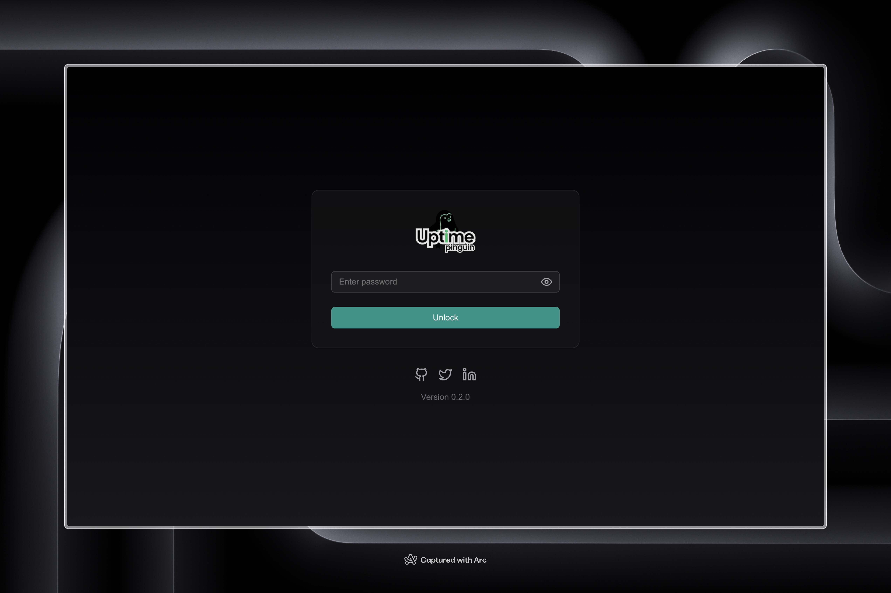
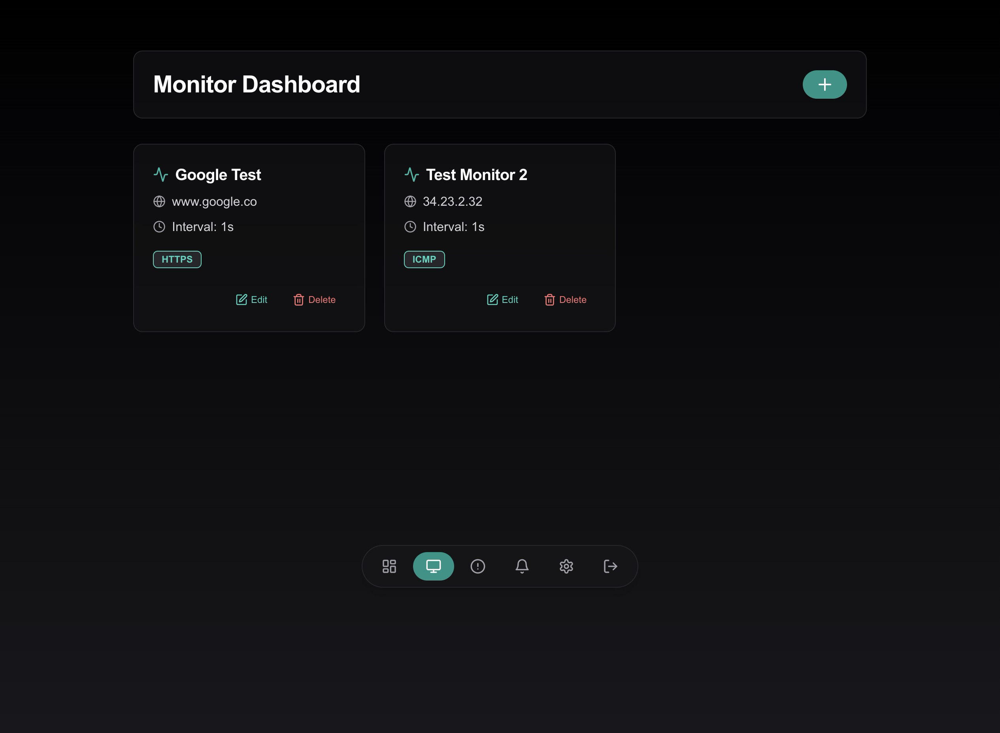
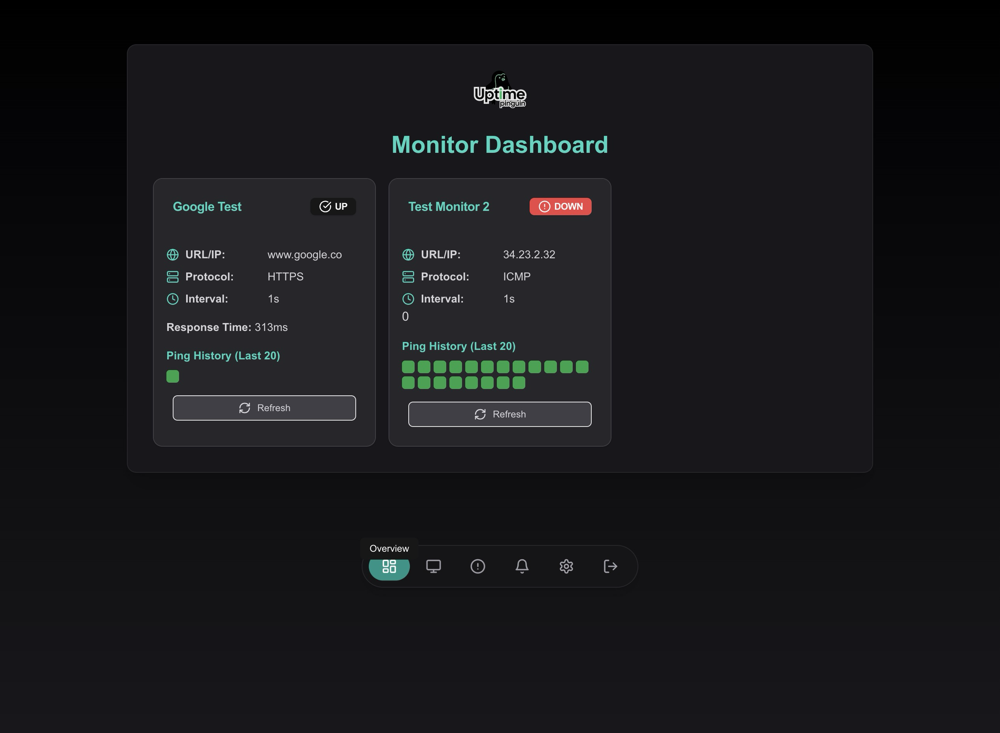
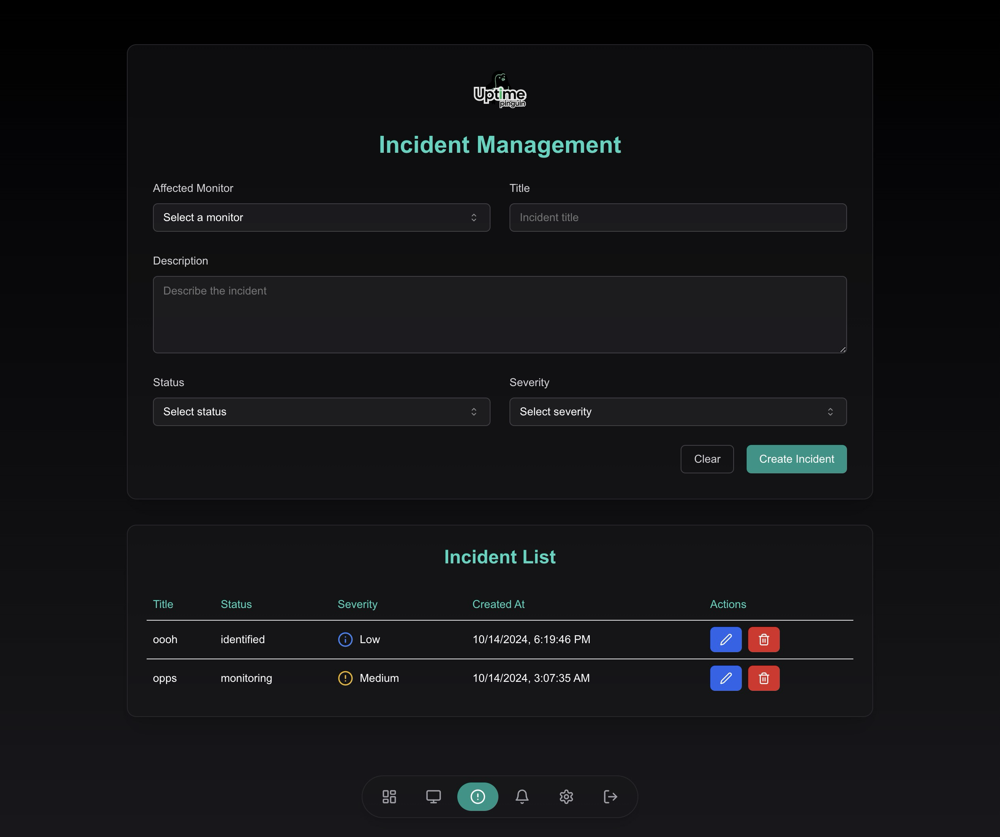
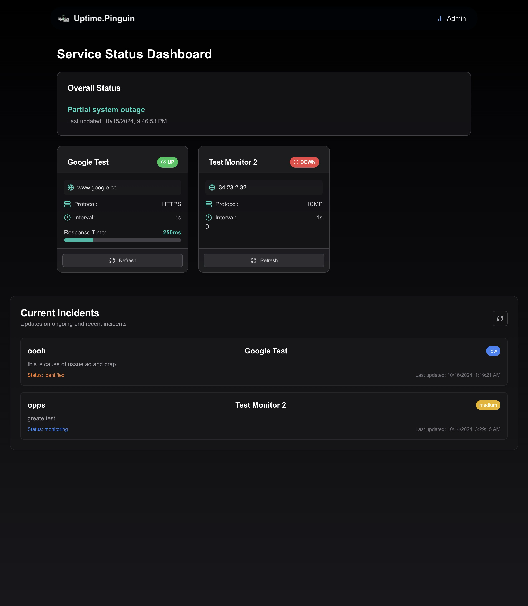

  

  # Uptime Pinguin

  

    <strong>Open-source uptime monitoring made simple and powerful</strong>
  

  
  
  
  
  

  <a href="#features">Features</a> •
  <a href="#preview">Preview</a> •
  <a href="#quick-start">Quick Start</a> •
  <a href="#usage">Usage</a> •
  <a href="#contributing">Contributing</a> •
  <a href="#license">License</a>

---

## 🚀 Features

Uptime Pinguin is your all-in-one solution for monitoring service availability and performance. Here's what makes it awesome:

- 🌐 **Multi-Protocol Support**: HTTP(S), TCP, ICMP, DNS, SMTP, POP3, IMAP, FTP, SSH, NTP, LDAP, SNMP (more coming soon!)
- ⚡ **Real-time Monitoring**: Instant updates on your services' status
- 🖥️ **Public Status Page**: Keep your users in the loop with a sleek, customizable dashboard
- 🚨 **Incident Management**: Create, update, and resolve issues like a pro
- 📢 **Discord Notifications**: Get alerts where your team already hangs out
- ⏱️ **Response Time Tracking**: Detailed performance metrics at your fingertips
- 🛠️ **Customizable Checks**: Tailor monitoring to your exact needs
- 🔒 **SSL/TLS Verification**: Ensure your HTTPS services are secure
- 📊 **Ping History**: Visualize uptime data over time

## 👀 Preview

Get a glimpse of Uptime Pinguin in action:

  
  
<em>Where you login to your account - password set in the env file</em>

  
  
<em>Create a new monitor: Add a new service to monitor</em>

  
  
<em>Dashboard: Overview of all your monitors</em>

  
  
<em>Incident Management: Create and track issues affecting your services</em>

  
  
<em>Public Status Page: Keep your users informed with a clean, accessible overview</em>

  
<em><strong style="text-decoration: underline;">The Design is still a work in progress, so any contributions are welcome!</strong></em>

## 🏁 Quick Start

1. **Adding Monitors**: Navigate to the "Monitors" page and click "Add Monitor" to set up a new service to track.

2. **Viewing Status**: The main dashboard displays the current status of all your monitors.

3. **Managing Incidents**: Use the "Incidents" page to create and manage incident reports for your services.

4. **Setting Up Notifications**: Go to the "Notifications" page to configure Discord webhook URLs for alerts.

## Contributing

We welcome contributions to Uptime Pinguin! Please read our [CONTRIBUTING.md](CONTRIBUTING.md) file for details on our code of conduct and the process for submitting pull requests.

## License

This project is licensed under the MIT License - see the [LICENSE.md](LICENSE.md) file for details.

## Acknowledgments

- Built with [Next.js](https://nextjs.org/)
- UI components from [shadcn/ui](https://ui.shadcn.com/)
- Icons by [Lucide](https://lucide.dev/)

## You don't have a one script to install this beast?

No, we use docker and ill make sure to provide guides to deploy on most platforms.

Platforms:

- Coolify
- Vercel (Maybe, love next but vercl can kick rocks)
- Docker (Self-hosted all the way)
- etc.. more later on.
---

Happy monitoring with Uptime Pinguin! 🐧📊
